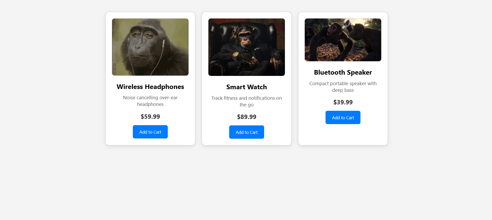

# Product_card
## Date: 09-07-2025
## Objective:

To replicate a product card layout similar to those found on real-time e-commerce platform like FlipKart using the CSS Box Model (margin, border, padding, and content).

## Tasks:

#### 1. Structure the HTML Layout:
Create a container ```<div>``` for the product card.

Add an `````` for the product image.

Include ```<h2>``` for product name, ```<p>``` for description, and a ```<span>``` or ```<div>``` for price.

Add a “Buy Now” or “Add to Cart” button.

#### 2. Apply Box Model Styling in CSS:
Use padding inside each section (image, text, button) to ensure readability.

Use margin around the card to space it from the page edges or other cards.

Add a border to outline the card.

Control width and height for consistent sizing.

#### 3. Visual Styling:
Add a background color to the card container.

Use box-shadow to simulate depth (card lifting effect).

Add border-radius for rounded corners.

#### 4. Center the Card:
Use display: flex and justify-content: center and align-items: center on the parent container.

#### 5. Bonus Enhancements:
Use a hover effect on the button (e.g., background color change).

Make the card responsive with percentage-based widths or media queries.
## HTML Code:
```html
<!DOCTYPE html>
<html lang="en">
<head>
  <meta charset="UTF-8" />
  <meta name="viewport" content="width=device-width, initial-scale=1.0"/>
  <title>Product Cards</title>
  <link rel="stylesheet" href="styles.css" />
</head>
<body>
  <div class="card-container">
    <div class="product-card">
      
      <h2>Wireless Headphones</h2>
      <p>Noise cancelling over-ear headphones</p>
      <div class="price">$59.99</div>
      <button class="buy-btn">Add to Cart</button>
    </div>

    <div class="product-card">
      
      <h2>Smart Watch</h2>
      <p>Track fitness and notifications on the go</p>
      <div class="price">$89.99</div>
      <button class="buy-btn">Add to Cart</button>
    </div>

    <div class="product-card">
      
      <h2>Bluetooth Speaker</h2>
      <p>Compact portable speaker with deep bass</p>
      <div class="price">$39.99</div>
      <button class="buy-btn">Add to Cart</button>
    </div>
  </div>
</body>
</html>

```
## CSS Code:
```css
* {
    box-sizing: border-box;
    margin: 0;
    padding: 0;
    font-family: 'Segoe UI', sans-serif;
}

body {
    background-color: #f4f4f4;
    padding: 40px;
}

.card-container {
    display: flex;
    flex-wrap: wrap;
    justify-content: center;
    gap: 20px;
}

.product-card {
    width: 280px;
    background-color: #fff;
    padding: 20px;
    border: 1px solid #ccc;
    border-radius: 12px;
    box-shadow: 0 4px 12px rgba(0, 0, 0, 0.1);
    text-align: center;
}

.product-card img {
    width: 100%;
    height: auto;
    border-radius: 8px;
    margin-bottom: 15px;
}

.product-card h2 {
    font-size: 1.3rem;
    margin-bottom: 10px;
}
.product-card p {
    font-size: 0.95rem;
    color: #555;
    margin-bottom: 15px;
}
.price {
    font-size: 1.2rem;
    font-weight: bold;
    color: #333;
    margin-bottom: 15px;
}

.buy-btn {
    background-color: #007bff;
    color: white;
    border: none;
    padding: 12px 20px;
    border-radius: 6px;
    cursor: pointer;
    transition: background-color 0.3s ease;
}
.buy-btn:hover {
    background-color: #0056b3;
}

@media (max-width: 768px) {
    .card-container {
        justify-content: center;
    }
    .product-card {
        width: 90%;
    }
}
```
## Output:

## Result:
A product card layout similar to those found on real-time e-commerce platform like FlipKart using the CSS Box Model is replicated successfully.
